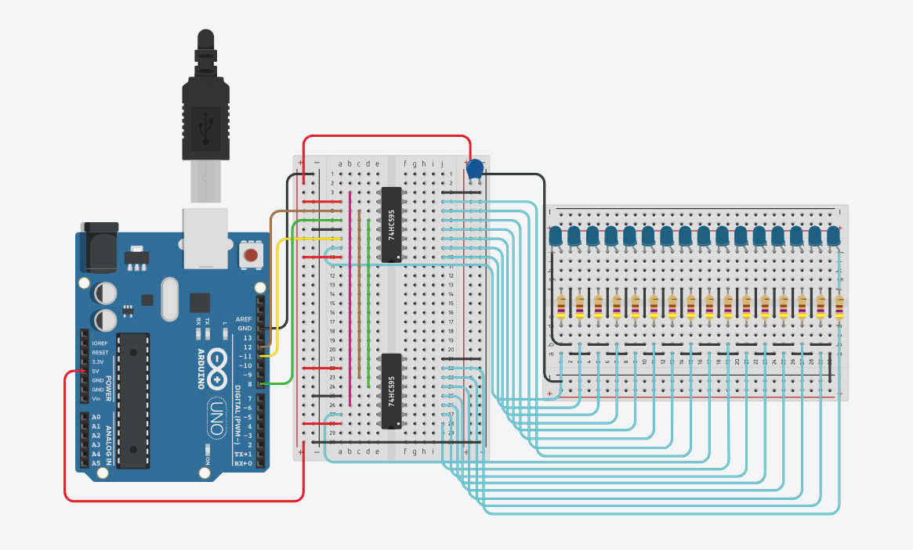

# LED Sound Visualizer using 74HC595 Shift Register

This project is a simple sound visualizer using a microphone/sound sensor and 74HC595 shift registers to drive multiple LEDs. The number of LEDs turned on corresponds to the detected sound level in real time.

## 🧰 Components Used

- Arduino (e.g., Uno, Nano)
- 74HC595 Shift Register(s)
- LEDs (multiples of 8)
- Resistors (for LEDs)
- Sound sensor module (analog output)
- Breadboard and jumper wires

## 📂 File Structure

- `blynk_led_based_on_music.ino`: Main Arduino sketch, reads sound level and updates LEDs accordingly.
- `ic74hc595.h` and `ic74hc595.cpp`: Custom class to control multiple 74HC595 shift registers.

## 🚀 How It Works

1. Initializes the shift registers and configures the sound sensor pin.
2. Calibrates minimum and maximum sound levels over a short period.
3. Continuously reads analog sound data.
4. Maps sound level to the number of LEDs to be turned on.
5. Animates the LEDs based on the current sound input.

## 🛠️ Usage

### 1. Wiring

Connect the 74HC595 to the Arduino as follows (adjust pins if needed):
- `latchPin` → D8
- `clockPin` → D12
- `dataPin` → D11

Connect the sound sensor analog output to `A0`.

Chain multiple 74HC595 ICs if you need to control more than 8 LEDs.

### 2. Upload

Use the Arduino IDE to upload `blynk_led_based_on_music.ino` to your board. Ensure that `ic74hc595.h` and `ic74hc595.cpp` are in a `libs/` folder or in the same project directory.

### 3. Monitor

Open Serial Monitor (9600 baud) to see sound values and LED mapping during operation.

## 📏 Customization

- Change `LENGTH_LED` to the number of LEDs you want to control.
- Adjust the `map()` range in `loop()` if your sound sensor behaves differently.
- You can tweak the animation speed using the `delay()` values.

---

Created by [Uri]
